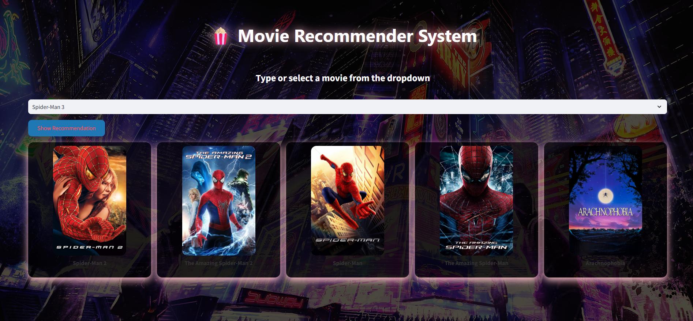
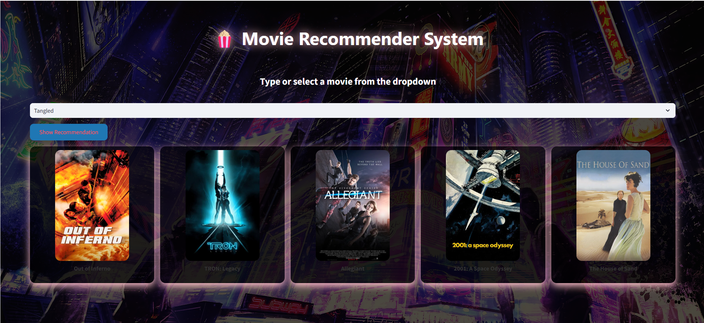
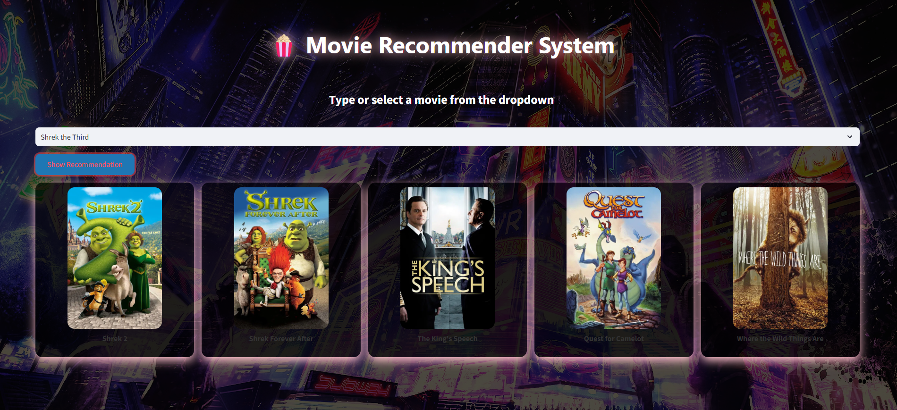

# 🍿 Movie Recommender System

Un système de recommandation de films interactif construit avec **Python**, **Streamlit** et l’API **TMDB**.  
L’application recommande des films similaires à celui que vous sélectionnez et affiche leurs posters.

---

## 🖼️ Aperçu (Screenshots)
      screenshot 1
  
      screenshot 2
  
      screenshot 3


## 🛠️ Technologies utilisées

- **Python 3**
- **Streamlit** – Interface web interactive
- **Pandas** – Manipulation de données
- **NumPy** – Calculs numériques
- **scikit-learn** – Calcul de similarité entre films
- **Requests** – Requêtes HTTP pour récupérer les posters depuis TMDB

---

## 📁 Structure du projet

movie-recommender/
│
├─ data/
│ ├─ tmdb_5000_movies.csv # CSV de données films
│ └─ tmdb_5000_credits.csv # CSV des crédits
│
├─ model/
│ ├─ movie_list.pkl # Liste des films (DataFrame)
│ └─ similarity.pkl # Matrice de similarité
│
├─ app.py # Application Streamlit
├─ generate_pickle.py # Script pour créer movie_list.pkl et similarity.pkl
└─ requirements.txt # Dépendances Python


---

## ⚡ Installation

1. Cloner le projet :

```bash
git clone https://github.com/ZSaba114/movie_recommender_system.ai.git
cd movie-recommender
Créer un environnement virtuel (recommandé) :

python -m venv venv
Activer l’environnement :

Windows :

venv\Scripts\activate
Mac/Linux :

source venv/bin/activate
Installer les dépendances :

pip install -r requirements.txt
Générer les fichiers .pkl nécessaires :

python generate_pickle.py
🚀 Lancer l’application
streamlit run app.py
L’application s’ouvrira automatiquement dans votre navigateur à l’adresse : http://localhost:8501

📝 Utilisation
Sélectionnez un film dans le menu déroulant.

Cliquez sur "Show Recommendation".

L’application affichera 5 films recommandés avec leurs posters.

🔗 API TMDB
Les posters des films sont récupérés via l’API The Movie Database (TMDB).

Vous n’avez pas besoin de télécharger la base TMDB localement, seuls les fichiers movie_list.pkl et similarity.pkl sont nécessaires.

📦 Fichier requirements.txt
streamlit
pandas
numpy
scikit-learn
requests
✨ Améliorations possibles
Ajouter la possibilité de filtrer par genre ou année de sortie.

Ajouter un système de notation par les utilisateurs.

Déployer l’application sur Streamlit Cloud ou Heroku.

Améliorer l’interface avec des animations et du CSS Streamlit.

